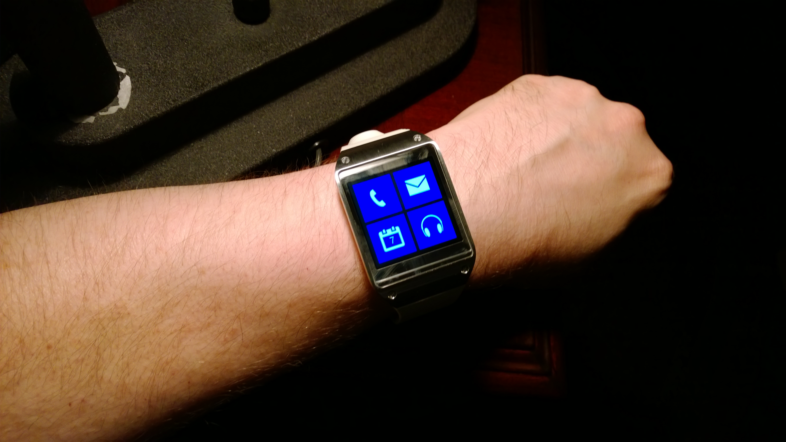

# GearWPClient
From my archives, an experimental shell app written in C# &amp; Xamarin.Android for the original Samsung Gear smartwatch (rooted) to give it the look &amp; feel of a Windows device.

## History
After landing a free Samsung Gear v1 a few years ago at the AT&T Dev Summit Hackathon, I found myself puzzled as to what to do with it given that i didn't have a Samsung smartphone to pair it to. I decided to root it with a modded Android build so I could actually use it independent of any phone, and also to build custom apps for it.

Being a fan of the Windows Phone & Windows platform and its UI (aka Metro), I thought it would be a cool experiment to turn it into a "Windows Smartwatch" from a look & feel point of view.

## Features
This app is a simple shell app written in C# with Xamarin.Android and it emulates the tiled UI of Windows on a smartwatch. It scrolls vertically with a touch-drag gesture like a smartphone, displaying 4 tiles at a time, 2-columns wide. The current implementation has 4 rows of tiles. Some tiles are currently static, others serve as launchers

It includes the following tiles:
* Phone
* Email
* Calendar
* Music
* Camera
* Photos
* Weather
* Settings

Now that Android Wear has matured, I have not really touched this project since its first build, but i still like the idea of a Windows-style shell on a smartwatch. This is what we have to an extent on the Microsoft Band, showing 3 tiles at a time on a single row of 12+ tiles.

    

## Screenshot

